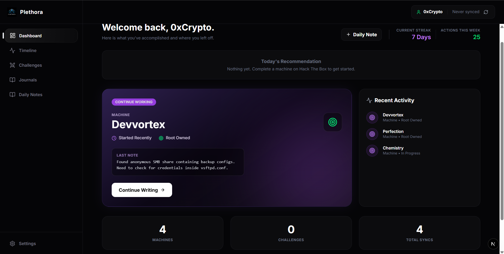
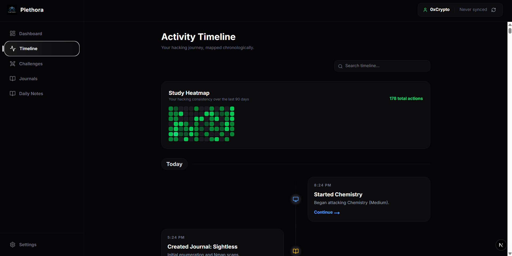
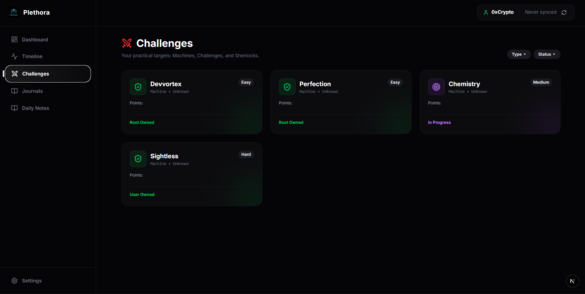
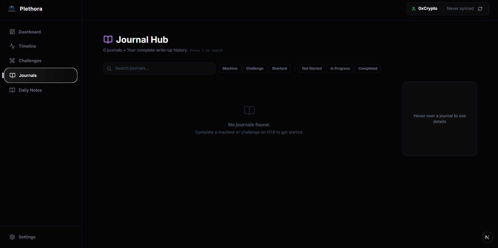

# Plethora

**[🌐 Visit Plethora Live](https://plethora-htb.vercel.app/)** *(Replace with your actual Vercel deployment URL)*

Plethora is an advanced Second Brain and Cybersecurity OS, built specifically for hackers, bug bounty hunters, and security researchers. It natively syncs with Hack The Box to track your progress and provides a robust, browser-based journaling system for your write-ups.

## Screenshots

<p align="center">
  
  
</p>
<p align="center">
  
  
</p>

## Features

- **100% Client-Side & Private**: No backend database. Everything is stored completely within your browser using IndexedDB. Your private write-ups and API keys never touch our servers.
- **Hack The Box Auto-Sync**: Connect your HTB App Token to automatically pull in your active and completed Machines, Challenges, and Sherlocks.
- **Global Activity Timeline**: A unified, searchable chronological feed tracking every action you take (solving machines, updating journals, adding screenshots, and more).
- **Rich Journaling Engine**: A powerful BlockNote-based editor with instant auto-save, markdown compilation, and inline screenshot pasting. Images are stored safely as base64 Data URIs directly in your local browser storage.
- **Command Palette (Ctrl+Q)**: A fully keyboard-driven command center to instantly search thousands of journals or quick-navigate through the app.
- **Daily Notes**: A dedicated space for general studying, scratchpads, and meeting notes, kept completely separate from your HTB write-ups.

## How to Use (No Installation Required!)

You don't need to install anything. Plethora runs entirely in your browser.

1. Go to the live website.
2. Click **Connect Hack The Box**.
3. To get your App Token, navigate to the [Hack The Box Dashboard](https://app.hackthebox.com/).
4. Click on **HTB Labs** and select **Start Playing**.
5. Once you reach the labs website, navigate to your **Profile Settings**.
6. Go to the **App Tokens** section and generate a new token.
7. Copy the generated token, paste it into Plethora, and click connect! Plethora will securely save this to your local browser database and begin importing your progress.

---

## Developers / Self-Hosting

If you want to modify Plethora or run it locally yourself:

### Prerequisites
- Node.js (v18 or higher)
- npm or pnpm

### Local Setup
1. Clone the repository:
   ```bash
   git clone https://github.com/krishjain-2301/Kri27.git
   cd Kri27/cybervault-ui
   ```

2. Install dependencies:
   ```bash
   npm install
   ```

3. Run the development server:
   ```bash
   npm run dev
   ```

4. Open `http://localhost:3000` in your browser.
