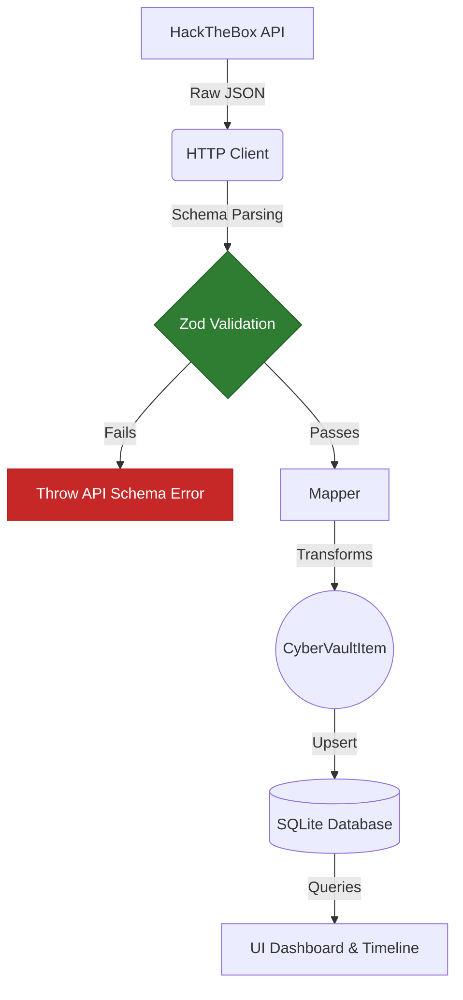

# Provider Flow Architecture

This diagram illustrates the core data pipeline for CyberVault's synchronization engine. This guarantees deterministic behavior and shields the local SQLite database from upstream API changes.

### Components
1. **HTTP Client**: Fetches raw data from versioned, hardcoded endpoints.
2. **Zod Validation**: Validates the payload against expected shapes. Strips out unused fields using `.pick()` or `.passthrough()`.
3. **Mapper**: Converts the strictly validated JSON into the generic `CyberVaultItem` model, applying any normalization (e.g., mapping "Very Easy" to our enum).
4. **Repository**: Executes `upsert` queries into the SQLite database based on `providerId`.
